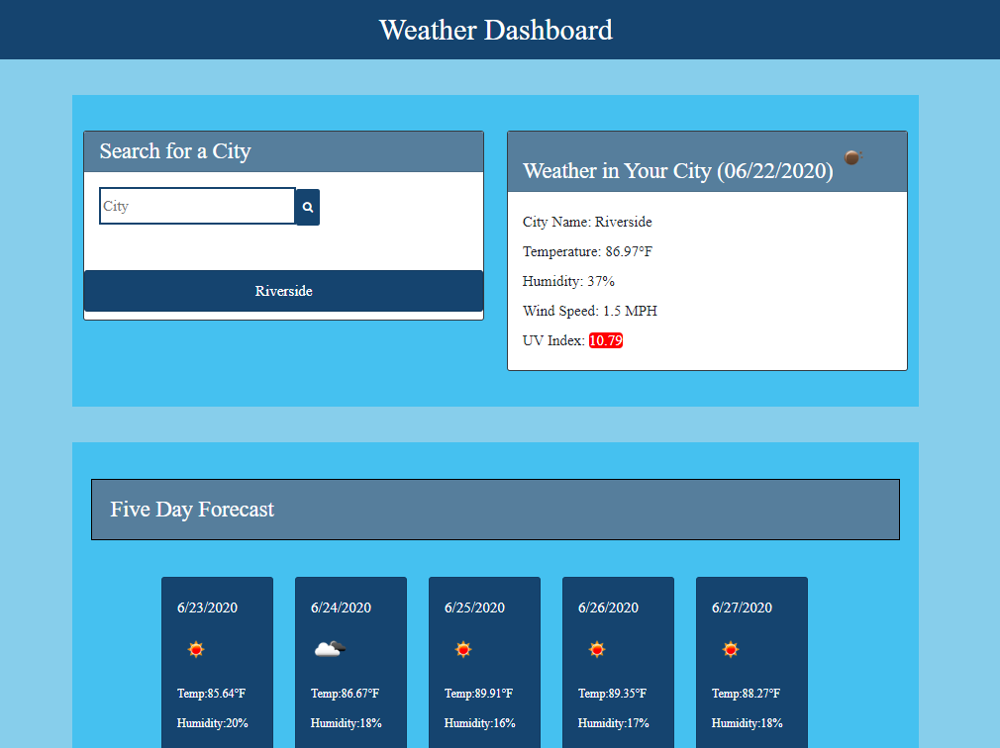

# Weather Dashboard

## Description

I have created a weather dashboard that will allow a user to get the current weather and a five day forecast for any city. They will enter the city name in the input, click the search button and the weather and forecast will be displayed. When a city is searched for, a button with its name will appear and the user can also click on this button to display the weather for that city. The weather dashboard is powered by the OpenWeather API.

<https://melindawinter.github.io/weather-dashboard/>

## Credits

Thank you to my tutor Thor Nolan, who helped me figure out the UV coloration and the local storage. Thanks also to Jeanette Hernandez, Kate An, Cyrus Jose, and Kevin Cabe who all collaborated with me during different points in the project and shared their ideas.

## License

I chose a permissive GNU license for this project, so that others can use and modify the code for their own purposes, but the source code cannot become proprietary and changes must be documented. The file name is LICENSE.
